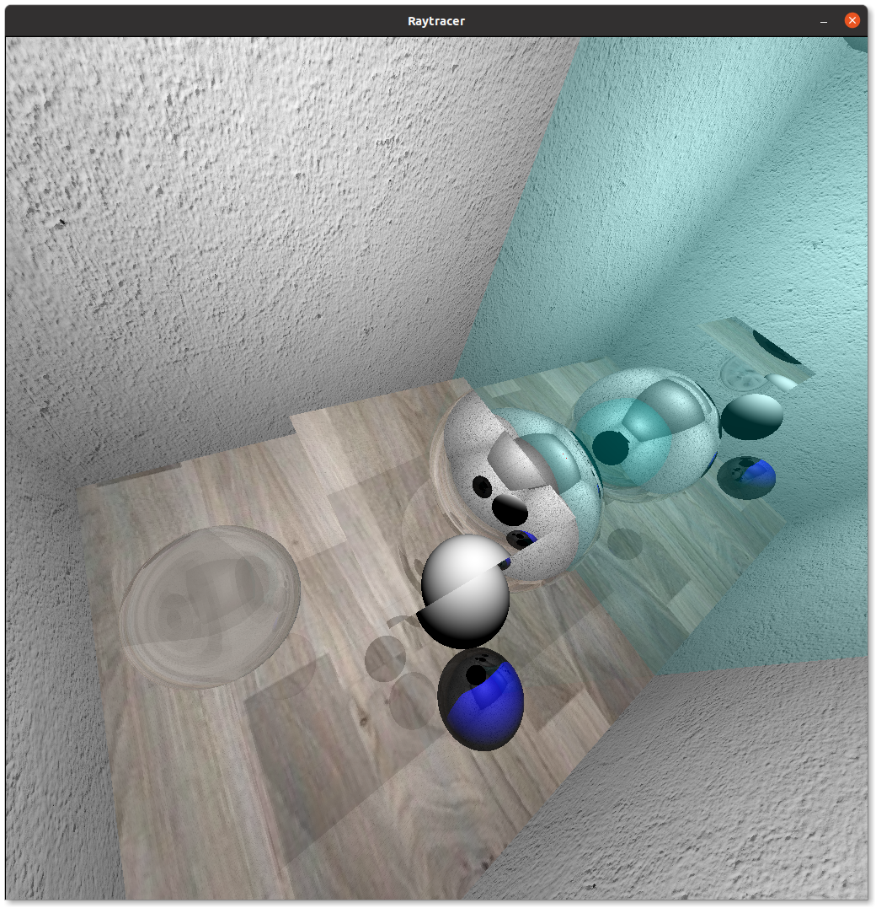

Raytracer based on Whitted, 1984 paper.

The room scene showing the refractions and reflections for thin and dense objects.

Only depends on `Qt` and `cmake`. Tested on Ubuntu 20.04 (should work on Windows as well).

Two primitives implemented so far:
* Triangle
* Sphere

The `display.cc` manages the drawing to the Qt canvas and also handles the keyboard input to the worker thread (world can be rotated using the arrows).

The worker thread calls the `Renderer.render()` in the `render.cc` once it receives a re-render signal from the environment.

The renderer sets up the viewport at initialization, and instantiates a `Scene` object in the constructor (a `RoomScene` is the only scene that is added in the `room_scene.cc`).

A `Scene` object has a `buildScene` method that instantiates the primitives using the `Models` helper class (only boxes and squares can be built using triangles) and the lights. It has the responsibility to intersect the ojbects in the scene using the `trace()` method. It casts a ray and matches the closest object primitive. The reference to the primitive is determined by a lookup based on the list of primitives in the scene and the matched object's `excite` function is called to determine its color at the intersection point.

Each object has a virtual `excite` method that receives the incoming `Ray` object, the `Intersection` struct (that contains the intersection info such as surface intersection point, surface normal at the intersection), and also, a weak reference to a `Scene` object that can be used to recursively cast further rays to intersect other objects (this is a cyclyc dependence, but the reference to the `Scene` object will not be stored).

How a primitive determines its color is depends on the particular  `Shader` object assigned to the primitive using the `setShader` method. For example, a `Triangle` accepts a `TriangleShader` while a `Sphere` receives a
`SphereShader` to react to the incoming ray. The `excite` function forward the parameters to the shader, hence the user can react to the incomint radiation. The `Shader` base class contain helper methods to determine the reflective or refractive ray direction. (The code to determine the diffuse component is implemented in the `Scene` because the lights should be considered to properly handle the shadows). An example shader, the `GenericTriangleShader` is implemented to handle the reflection and the refraction. For the `Sphere`, a similar shader is added, but it is a bit more complicated because it is a dense object so the normals should be adjusted for refraction when the ray is entering or leaving the object.

The user can freely implement new custom shaders for better simulation.